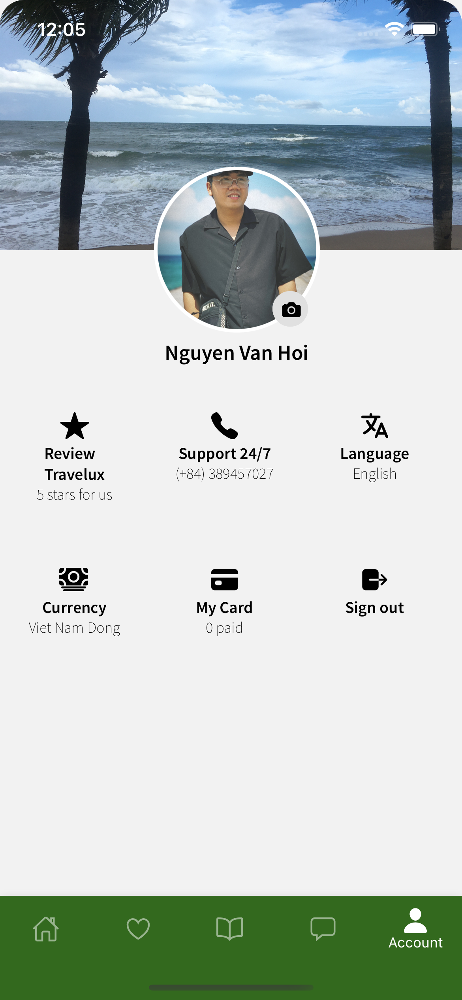

<p align="center">

</p>
<h3 align="center">
Travelux
</h3>
<p align="center">
This is a small demo on how to structure folders in react native and the basic look and feel for a booking app. This is also a project where I can learn and practice on how to build a mobile app.
</p>

## Screenshots

<span>

</span>
<span>

</span>
<span>

</span>
<span>

</span>
<span>

</span>

## Tech stack

- Typescript
- React Navigation
- Redux (Redux toolkit, Redux Saga, Redux Persist)
- Theme (dark theme, light theme)
- Form (React hook form)
- Firebase (Authentication)
- Push notification (local, firebase)
- ...

## Designs

<span>
You can find all of the app's designs here: <a href="https://www.figma.com/file/MLmKKyZsPGpEWYQQwajgFj/Travelux-mobile?node-id=0%3A1">Figma</a>
</span>

## Development

```bash
# Clone
git clone git@github.com:yantee98/travelux-app.git

# Dependencies
yarn install

# iOS only
cd ios && pod install && cd ..

# Run iOS
npx react-native run-ios

# Run Android
npx react-native run-android

```

## Notes

If you want to use firebase then first you need to create app in firebase then replace 2 files `google-services.json` in android and `GoogleService-Info.plist` in ios. Details about the settings can be found at: https://rnfirebase.io/
